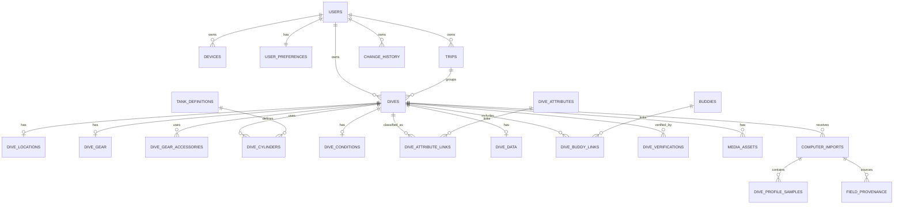

# DiveCircle Personal Dive Log — Schema v1

Status: **Draft for implementation review**

This document is the technical source of truth for the first DiveCircle Personal Dive Log data model.

## Product rules this schema must preserve

1. **Personal Dive Log first.** Community features are an extension of the personal log, never the reason the log exists.
2. **Local-first.** The diver's device holds a complete private working copy of their dive data. Internet connectivity is optional for normal logging.
3. **Private by default.** Cloud sync is for private backup, private web viewing, and future multi-device use. Community sharing is explicit and opt-in.
4. **Fast entry.** The data model must support prefill, reusable values, Copy to Next Dive, and dive-computer import without forcing repeated typing.
5. **Search is first-class.** Structured values are retained specifically so the user's own input data can become powerful search filters.
6. **International-ready.** Stored codes are language-neutral. UI labels are translated separately. Free text is Unicode.
7. **User control.** Imported dive-computer data may be manually edited. Manual edits are flagged and imported originals are preserved where practical.
8. **Future DiveCircle compatibility.** Personal records remain owned by the diver even when they are later linked to shared DiveCircle places, users, trips, or community publications.

---

# 1. Identity and synchronization

## 1.1 Hidden IDs

All syncable entities use a hidden **UUIDv7** primary key generated on the device.

- SQLite: store UUIDv7 as canonical text.
- PostgreSQL: store as `uuid`.
- The UUID is never the diver-facing Dive Log number.

## 1.2 Standard sync envelope

Unless noted otherwise, every user-owned syncable table includes:

| Column | Meaning |
|---|---|
| `id` | UUIDv7 primary key |
| `user_id` | Owner |
| `created_at` | Creation timestamp |
| `updated_at` | Last modification timestamp |
| `deleted_at` | Soft-delete/tombstone timestamp, nullable |
| `revision` | Monotonic row revision |
| `origin_device_id` | Device that originally created the row |

The cloud service must never silently discard conflicting edits. Conflicts are detected and preserved for resolution.

## 1.3 Current dive is device state

The current/last active Dive Log is stored as user/device state, not as an `is_current` flag on a dive record.

---

# 2. Lifetime Dive Number

The diver-facing number is named:

`lifetime_dive_number`

It answers exactly:

> **How many dives have you done in your lifetime?**

Examples:

- Dive #37 = the diver's 37th lifetime dive.
- A diver who already completed 326 dives before joining DiveCircle can begin with Dive #327.

Rules:

- It is **not** a database identity.
- It is unique among one user's actual dives.
- The cloud enforces `UNIQUE(user_id, lifetime_dive_number)` for non-void actual dives.
- A voided record that never represented a real dive does not permanently consume a lifetime number.
- Soft-deleting a real dive does not erase the fact that it occurred.
- A deliberate correction/renumbering workflow may repair historical numbering.
- Numbering must never be silently changed by sync.

### Multi-device note

Because this number is a true lifetime ordinal, DiveCircle must not reserve large number blocks that could create visible gaps. V1 assumes one normal logging authority at a time and detects duplicate lifetime numbers during sync. A future online number lease/coordinator may be added without changing the schema.

---

# 3. Core tables

## 3.1 `users`

Cloud account identity.

Core fields:

- `id`
- `display_name`
- `locale`
- `created_at`
- `updated_at`

Local databases only need the owner's account/profile subset.

## 3.2 `devices`

Tracks app devices participating in sync.

Core fields:

- `id`
- `user_id`
- `device_name`
- `platform`
- `last_sync_at`
- `created_at`

## 3.3 `user_preferences`

Stores user-facing defaults and app behavior.

Core fields:

- `user_id`
- `language_code`
- `locale_code`
- `depth_unit`
- `visibility_unit`
- `temperature_unit`
- `pressure_unit`
- `weight_unit`
- `time_format`
- `next_lifetime_dive_number`
- `current_dive_id` nullable for local/device-scoped use where appropriate

---

# 4. Trips

## `trips`

Trips exist from day one even if the full Trip UI arrives later.

Core fields:

- `id`
- `user_id`
- `name`
- `start_date`
- `end_date`
- `notes`

A dive may have a nullable `trip_id`.

---

# 5. Dives — master record

## `dives`

The intentionally small master record.

Core fields:

- `id`
- `user_id`
- `lifetime_dive_number`
- `dive_date`
- `trip_id` nullable
- `status`: `DRAFT | LOGGED | VOID`
- `dive_experience_rating` nullable integer 1–5
- sync envelope fields

### Rating meaning

`dive_experience_rating` answers:

> **How great / memorable was this dive overall?**

It is independent of gear satisfaction.

---

# 6. Location

## `dive_locations`

One snapshot row per dive.

Core fields:

- `dive_id`
- `country_code`
- `country_text`
- `region_place_id` nullable
- `region_text`
- `lodging_place_id` nullable
- `lodging_text`
- `dive_site_place_id` nullable
- `dive_site_text`

The text snapshot preserves exactly what the diver recorded at the time. Optional IDs can later link the personal dive to shared DiveCircle entities.

## `saved_places`

Optional private reusable place records used for suggestions/dropdowns.

Core fields:

- `id`
- `user_id`
- `place_type`: `REGION | LODGING | DIVE_SITE`
- `country_code`
- `parent_place_id` nullable
- `display_name`
- `community_place_id` nullable

The app may also derive dropdown suggestions directly from historical `dive_locations`.

---

# 7. Gear

## 7.1 `dive_gear`

One gear-summary row per dive.

Core fields:

- `dive_id`
- `exposure_suit_text`
- `underlayer_text`
- `weight_kg`
- `cap_hood_text`
- `gloves_text`
- `boots_text`
- `other_exposure_text`
- `camera_text`
- `knife`
- `backup_knife`
- `dive_light`
- `backup_light`
- `beacon`
- `smb`
- `noise_maker`
- `whistle`
- `compass`
- `slate`
- `gear_comfort_rating` nullable integer 1–5
- `gear_notes` nullable

### Gear Comfort meaning

`gear_comfort_rating` is an overall satisfaction rating for how the diver's entire gear setup performed on that dive.

It may reflect any issue: leaking mask, uncomfortable fins, loose weight pocket, thermal comfort, poor fit, awkward setup, or everything working perfectly.

It is **not** a manufacturer/product review.

## 7.2 `exposure_options`

Private reusable source for:

- Exposure Suit
- Underlayer
- Other Exposure

Core fields:

- `id`
- `user_id`
- `display_name`
- `sort_order`
- `archived`

## 7.3 `accessory_options`

Private reusable source for Other Accessory fields.

Core fields:

- `id`
- `user_id`
- `display_name`
- `sort_order`
- `archived`

## 7.4 `dive_gear_accessories`

Variable-length accessory rows instead of ten hard-coded database columns.

Core fields:

- `id`
- `dive_id`
- `accessory_option_id` nullable
- `accessory_text`
- `sequence`

The UI may currently expose up to 10 Other Accessory combo boxes.

---

# 8. Cylinders and gas

## `tank_definitions`

Reusable personal/built-in cylinder definitions.

Core fields:

- `id`
- `user_id` nullable for built-ins
- `display_name`
- `material_code`
- `water_volume_l`
- `working_pressure_bar`

## `dive_cylinders`

One or more cylinders may be attached to a dive.

Core fields:

- `id`
- `dive_id`
- `sequence`
- `tank_definition_id` nullable
- `tank_text`
- `oxygen_fraction` nullable
- `helium_fraction` nullable
- `start_pressure_bar` nullable
- `end_pressure_bar` nullable

For most recreational dives there will be one row.

This structure allows future SAC/RMV calculations and multi-cylinder dives without changing the user-facing workflow.

---

# 9. Conditions

## `dive_conditions`

One row per dive.

Core fields:

- `dive_id`
- `day_night`: `DAY | NIGHT`
- `dive_platform`: `SHORE | BOAT | LIVEABOARD`
- `is_drift`
- `surface_condition`: `CLEAR | PARTLY_CLOUDY | CLOUDY | RAINY`
- `surface_air_temp_c`
- `water_type`: `FRESH | SALT`
- `visibility_m`
- `visibility_at_least` boolean
- `swell`: `NONE | LOW | MODERATE | HEAVY`
- `current_strength`: `NONE | LIGHT | MODERATE | STRONG`
- `surge`: `NONE | LIGHT | MODERATE | STRONG`

### Visibility behavior

The UI slider is 0–100+ ft in 5 ft increments.

- Slider at `100+` stores the converted 100 ft threshold and `visibility_at_least = true`.
- Direct numeric entry may store values above 100 ft with `visibility_at_least = false`.

Bottom Water Temperature is **not** stored here. It belongs to Dive Data.

---

# 10. Dive attributes

## `dive_attributes`

Supports built-in translatable attributes and future custom attributes.

Core fields:

- `id`
- `code` nullable for custom values
- `user_id` nullable; null for built-in global values
- `custom_label` nullable

Initial built-ins:

- `REEF`
- `WRECK`
- `WALL`
- `PINNACLE`
- `PASS_THROUGH`
- `MUCK`
- `SANDY_BOTTOM`

## `dive_attribute_links`

Many-to-many relationship.

Core fields:

- `dive_id`
- `attribute_id`

A dive may therefore be `REEF + WALL + PASS_THROUGH`.

---

# 11. Dive Data

## `dive_data`

Canonical summary values used by the ordinary Dive Log.

Core fields:

- `dive_id`
- `time_in_local`
- `time_out_local`
- `time_zone_name` nullable
- `utc_offset_minutes` nullable
- `bottom_time_seconds`
- `average_depth_m`
- `max_depth_m`
- `bottom_water_temp_c`
- `notes`

Start/end tank pressure belong to `dive_cylinders`, even though the UI displays them on the Dive Data screen.

### Time rule

Dive date and local dive times preserve the date/time experienced at the dive location. Traveling home must never cause the dive to display on the wrong calendar date.

### Dive Notes

Notes are freeform Unicode text and may cover the entire experience from preparation/arrival through leaving the site.

Future UI may support phone dictation directly into this field.

---

# 12. Dive-computer import and provenance

## 12.1 `dive_computers`

Reusable device records.

Core fields:

- `id`
- `user_id`
- `manufacturer`
- `model`
- `serial_number` nullable
- `device_identifier` nullable

## 12.2 `computer_imports`

One imported source-dive record.

Core fields:

- `id`
- `user_id`
- `dive_id` nullable until matched
- `dive_computer_id`
- `external_dive_id` nullable
- `source_format`
- `imported_at`
- `raw_payload_reference` nullable
- `source_hash` nullable

## 12.3 `field_provenance`

Tracks where individual canonical values came from.

Core fields:

- `id`
- `user_id`
- `entity_type`
- `entity_id`
- `field_name`
- `source_type`: `MANUAL | IMPORTED | MANUAL_EDIT`
- `source_import_id` nullable
- `original_imported_value_json` nullable
- `manually_edited` boolean
- `updated_at`

Recommended unique key:

`UNIQUE(user_id, entity_type, entity_id, field_name)`

### Import rules

- Import fills blanks and adds detail.
- Import does not silently overwrite user-entered values.
- Manual editing always remains possible.
- If an imported value is manually changed, the canonical value changes, `manually_edited` is flagged, and the imported original is retained where practical.

## 12.4 `dive_profile_samples`

Detailed computer telemetry stays separate from the normal Dive Log.

Core fields:

- `id`
- `computer_import_id`
- `elapsed_seconds`
- `depth_m` nullable
- `temperature_c` nullable
- `tank_pressure_bar` nullable
- `heart_rate_bpm` nullable
- `ascent_rate_m_per_min` nullable

Additional telemetry fields/events may be added by migration without changing the canonical Dive Log schema.

---

# 13. Buddies

## `buddies`

Reusable private buddy records.

Core fields:

- `id`
- `user_id`
- `display_name`
- `linked_user_id` nullable
- `notes` nullable

A saved buddy may later link to a real DiveCircle user without rewriting historical dives.

## `dive_buddy_links`

Supports one or more buddies per dive.

Core fields:

- `dive_id`
- `buddy_id`

---

# 14. Instructor / verification records

## `dive_verifications`

Optional child records.

Core fields:

- `id`
- `dive_id`
- `verifier_name`
- `verifier_user_id` nullable
- `agency` nullable
- `certification_number` nullable
- `verification_type`
- `verified_at` nullable
- `notes` nullable

The feature may remain hidden from the earliest UI while staying supported by the architecture.

---

# 15. Media

## `media_assets`

Private linked media records.

Core fields:

- `id`
- `user_id`
- `dive_id` nullable
- `trip_id` nullable
- `local_uri` nullable
- `cloud_object_key` nullable
- `media_type`
- `caption` nullable
- `captured_at` nullable
- `file_checksum` nullable

The local record and synced cloud object are separate concepts.

---

# 16. Audit / history

## `change_history`

Important user-data changes may be retained for recovery, debugging, import provenance, and sync.

Core fields:

- `id`
- `user_id`
- `entity_type`
- `entity_id`
- `field_name`
- `old_value_json`
- `new_value_json`
- `change_source`
- `device_id`
- `changed_at`

This is not intended to event-source the entire application.

---

# 17. Units and localization

## Internal canonical units

- Depth / visibility: **meters**
- Temperature: **°C**
- Pressure: **bar**
- Weight: **kg**
- Durations: **seconds**

The UI converts to the user's preferences.

## Language-neutral codes

Never persist translated UI strings as enumerated values.

Store:

`DAY`, `LIVEABOARD`, `MODERATE`, `REEF`

not:

`Day`, `Liveaboard`, `Moderate`, `Reef`

Translation resources provide localized labels.

Freeform text uses Unicode.

---

# 18. Copy to Next Dive policy

Copy behavior belongs in application/service logic, not in duplicated database schemas.

| Data | Copyable | Checked by default |
|---|---|---|
| Date | Yes | **No** |
| Country | Yes | Yes |
| State/Region | Yes | Yes |
| Resort/Lodging | Yes | Yes |
| Dive Site | Yes | No |
| Gear setup | Yes | Yes |
| Gear Comfort Rating | **No** | — |
| Gear Notes | **No** | — |
| Day/Night | Yes | Day copies if prior dive was Day; Night does not default-copy |
| Shore/Boat/Liveaboard | Yes | Yes |
| Drift | Yes | Yes |
| Fresh/Salt Water | Yes | Yes |
| Surface weather | Yes | No |
| Surface air temp | Yes | No |
| Visibility | Yes | No |
| Swell | Yes | No |
| Current | Yes | No |
| Surge | Yes | No |
| Dive Attributes | Yes | No |
| Dive Data | **No** | — |
| Dive Experience Rating | **No** | — |

Buddy copy-default behavior remains a UI/workflow decision and is intentionally not hard-coded into the database.

If Date is not copied, the new dive is created first and then the app automatically opens the special Date Prompt Mode.

---

# 19. Search indexes

Search is a core product feature.

At minimum, index or otherwise optimize:

- `dives.dive_date`
- `dives.lifetime_dive_number`
- trip
- country
- region
- lodging
- dive site
- buddy
- exposure suit
- tank/gas
- water type
- Shore/Boat/Liveaboard
- drift
- surface condition
- visibility
- swell/current/surge
- dive attributes
- average/max depth
- bottom water temperature
- dive experience rating
- gear comfort rating

Dive Notes should use full-text search:

- SQLite: FTS5 or equivalent local search index
- PostgreSQL: full-text index suitable for server/web search

Cascading search choices should be derived from the user's actual stored data.

---

# 20. Calculated values

Do not store authoritative lifetime aggregates that can drift out of sync.

Calculate from source records where practical:

- accumulated bottom time
- deepest dive
- average depths
- dives by year/location
- consumption rates
- SAC/RMV
- other statistics

Caching is allowed for performance, but the cache is never the source of truth.

Important distinction:

- **Logged dive count** = number of stored actual dive records.
- **Lifetime dive number/count** = the diver's lifetime ordinal, which may include dives logged elsewhere before DiveCircle.

---

# 21. Community boundary

The private Dive Log is not a social-media row.

Future DiveCircle Community sharing must use a separate publication layer:

```text
PRIVATE PERSONAL RECORD
        |
        | explicit user-selected publication
        v
COMMUNITY PUBLICATION
```

Only selected fields are published.

Unsharing removes/withdraws the community publication without modifying the user's private Dive Log.

Community tables/services are intentionally outside Personal Dive Log Schema v1.

---

# 22. Local SQLite ↔ cloud PostgreSQL mapping

| Concept | SQLite | PostgreSQL |
|---|---|---|
| UUIDv7 | TEXT | UUID |
| Boolean | INTEGER 0/1 | BOOLEAN |
| Enum-like code | TEXT + CHECK | TEXT + CHECK / lookup |
| Date | ISO `YYYY-MM-DD` text | DATE |
| Local time | ISO time text | TIME |
| Timestamp | ISO-8601 UTC text | TIMESTAMPTZ |
| JSON values | JSON text | JSONB |
| Full text | FTS5 | PostgreSQL FTS |

Avoid PostgreSQL-native enum types in the shared logical model so values can evolve cleanly across both databases.

---

# 23. Core ER diagram



---

# 24. Implementation order

1. Create portable migration conventions.
2. Implement core identity/sync columns.
3. Implement `dives`, `dive_locations`, `dive_gear`, `dive_conditions`, `dive_data`.
4. Add variable child tables: attributes, accessories, cylinders, buddies.
5. Add provenance/import tables early so manual and imported data use the same canonical model.
6. Add search indexes.
7. Add trips/media/verification support.
8. Build local sync adapter and cloud schema mapping.
9. Only after the personal log is excellent, add the separate DiveCircle Community publication layer.

---

# 25. Schema v1 definition of success

Schema v1 is successful if it can support the complete personal Dive Log experience without destructive redesign when we later add:

- offline sync
- private web viewing
- dive-computer import
- multiple languages
- thousands of users
- multi-device accounts
- advanced search
- trips
- gear history
- media
- optional DiveCircle Community sharing

The Personal Dive Log remains the foundation.
